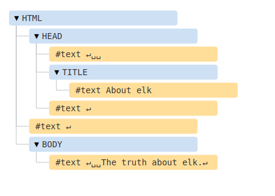

# DOM Tree
- https://javascript.info/dom-nodes

        According to the Document Object Model (DOM), every HTML tag is an object. Nested tags are “children” of the enclosing one. The text inside a tag is an object as well.

- The DOM represents HTML as a tree of tags

```HTML
<!DOCTYPE HTML>
<html>
<head>
  <title>About elk</title>
</head>
<body>
  The truth about elk.
</body>
</html>
```
<p align="center"></p>

- Every tree node is an object.

- The text inside elements forms text nodes, labelled as #text. A text node contains only a string. It may not have children and is always a leaf of the tree.

        Please note the special characters in text nodes:

            a newline: ↵ (in JavaScript known as \n)

            a space: ␣
        
        Spaces and newlines are totally valid characters, like letters and digits. They form text nodes and become a part of the DOM.

- There are only two top-level exclusions:

- Spaces and newlines before ```<head>``` are ignored for historical reasons.

- If we put something after ```</body>```, then that is automatically moved inside the body, at the end, as the HTML spec requires that all content must be inside ```<body>```. So there can’t be any spaces after ```</body>```.

### Autocorrection

- If the browser encounters malformed HTML, it automatically corrects it when making the DOM.

- Automatically close or add tags.